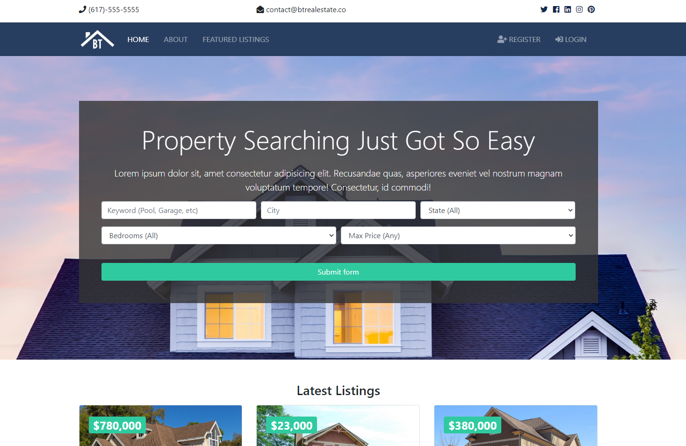

# BT Real Estate

## Table of Contents
* [General info](#general-information)
* [Tech](#Technologies)
* [Setup](#Setup)
* [Update](#Updates)

## General Information
This is a property search web application for a fictional real estate company, BT Real Estate. The homepage lists the three latest listings, whilst the **'Featured Listings'** page shows all their listings. A user can register on the homepage and with this, they will have their own dashboard where they can track all their property inquiries.





## Technologies
This project was created using the following technologies:
* Python
* Django
* PostgreSQL

## Setup
To run this project, after cloning this locally (on Windows), set up a virtual environment and access it by:

```
venv\Scripts\activate.bat
```

### Updates
Coming soon